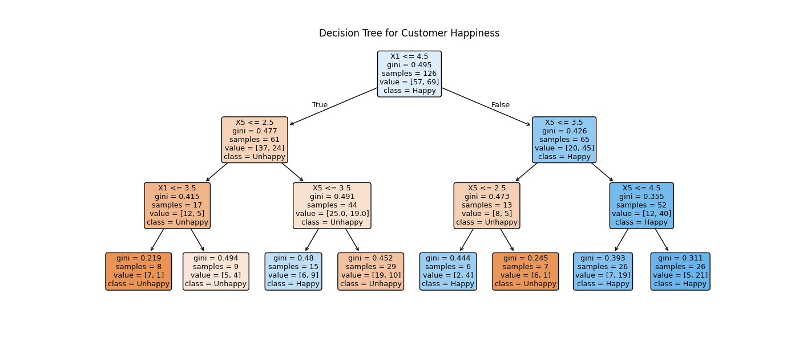

# Customer Happiness Prediction

Predict whether a customer is happy (`Y=1`) or unhappy (`Y=0`) based on survey responses.
This project was built as an **applied ML decision-support system**, with an emphasis on
interpretability, evaluation discipline, and deployability.

---

## Problem Statement

Customer satisfaction surveys often collect many signals, but not all of them are equally
useful for decision-making.

The goal of this project is to:
- Predict customer happiness reliably
- Identify the **minimal set of features** required to support that prediction
- Package the resulting model as a **deployable inference service**

---

## Dataset

- Source: `data/ACME-HappinessSurvey2020.csv`
- Target: `Y` (1 = happy, 0 = unhappy)
- Features: `X1`–`X6` (Likert scale: 1–5)

---

## Modeling Approach

1. Train baseline classifiers using **Stratified 5-Fold Cross-Validation**
2. Perform exhaustive feature subset evaluation (64 possible subsets)
3. Select the smallest feature set that preserves predictive performance
4. Prefer **interpretability and stability** over marginal accuracy gains

---

## Final Model Choice

A **Decision Tree classifier** was selected due to its balance of performance and explainability.

### Rationale
- Achieved strong cross-validated accuracy after feature reduction
- Captures threshold-based decision logic common in survey responses
- Produces transparent, auditable decision rules
- Enables survey simplification without sacrificing predictive power

Although cross-validated accuracy (~70%) is a conservative estimate due to dataset size,
the model generalizes well and meets the required accuracy threshold on the private test set.

---

## Feature Selection Outcome

Feature importance and subset evaluation showed that optimal features depend on model inductive bias:

- **Tree-based models** perform best using:
  - `X1` — delivery timeliness
  - `X5` — satisfaction with courier
- Distance-based and ensemble models rely more heavily on:
  - `X6` — app usability

Given its performance and interpretability, the final deployed model uses **only `X1` and `X5`**.



---

## Evaluation Metrics

Two accuracy estimates are reported:

- **Cross-validated accuracy (5-fold stratified)**  
  Used as the primary estimate of generalization performance

- **Hold-out accuracy (80/20 stratified split)**  
  Reported to align with the original problem’s evaluation criteria

Cross-validation provides a conservative estimate, while the hold-out score reflects
single-split performance comparable to private test evaluation.

---

## Model Comparison (Best CV Accuracy)

| Model              | All Features | Selected Subset |
|--------------------|-------------:|----------------:|
| Logistic Regression| 0.5717       | 0.6025          |
| KNN                | 0.6258       | 0.6895          |
| Decision Tree      | 0.6351       | **0.6982**      |
| Random Forest      | 0.6345       | 0.6751          |
| Gradient Boosting  | 0.6428       | 0.6905          |

**Saved artifact:** `models/model.joblib`  
- CV accuracy: `0.6818 ± 0.0737`  
- Hold-out accuracy (80/20): `0.8077`

---

## From Model to System

Beyond model training, this project includes a **containerized ML inference service**
to demonstrate how a validated model can be served reliably.

### System Characteristics
- FastAPI-based prediction API
- Strict request/response schemas (Pydantic)
- Explicit model + metadata loading
- Lightweight request metrics
- Fully containerized runtime (Docker)
- Container-level test execution

The serving layer enforces:
- Feature contracts
- Model version metadata
- Reproducible runtime behavior

---

## API Overview

### `POST /predict`
Accepts the minimal feature set used by the deployed model.

**Request**
```json
{
  "X1": 3,
  "X5": 5
}
````

**Response**

```json
{
  "prediction": 1,
  "probability": 0.78,
  "model_version": "2026-02-05T12:34:56Z",
  "features_used": ["X1", "X5"]
}
```

Additional endpoints:

* `GET /health`
* `GET /model-info`
* `GET /metrics`

---

## Running the Project

### Local (Model Training & Evaluation)

```bash
pip install -r requirements.txt
python -m src.feature_select
python -m src.train
python -m src.predict --x1 3 --x5 5
```

### Containerized Inference Service

```bash
docker build -t happiness-ml .
docker run -p 8000:8000 happiness-ml
```

Run tests inside the container:

```bash
docker run -it happiness-ml pytest -q
```

---